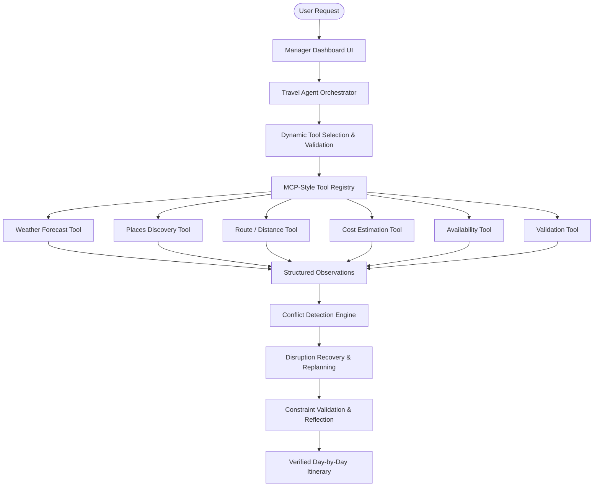

# Resilient Horizon Travel Engine

**Resilient Horizon** is an AI-powered agentic travel planning and itinerary recovery web application. Unlike simple static travel generators, Resilient Horizon dynamically evaluates real-world conditions, detects disruptions (such as weather alerts), searches for preference-matched indoor alternatives, recalculates transit times and costs, and verifies full constraint satisfaction.

---

## Architecture Diagram



---

## Key Features

1. **Manager-Friendly Dashboard**: Clean visual stages (Understand, Plan, Observe, Detect, Recover, Verify, Final Plan) with short user-safe progress text.
2. **MCP-Style Tool Boundaries**: Standardized input/output schemas for Weather, Places, Route, Availability, Cost, and Validation tools.
3. **Disruption & Recovery Engine**: Detects outdoor weather conflicts, replaces affected activities with preference-matched indoor alternatives, recalculates time and cost, and verifies budget compliance.
4. **Deterministic Demo Mode**: Built-in mock provider allowing reliable presentation of the 4-day Goa weather disruption scenario without requiring external API keys.
5. **Transparent Evidence Trail**: Expandable section exposing raw tool observations and validation results.

---

## Dynamic Tools Registry

- `weather.getForecast`: Fetches forecast conditions and evaluates outdoor suitability.
- `places.searchAttractions`: Finds top attractions filtered by user interests (e.g., Beaches, Historical Places, Indoor).
- `route.estimateTravel`: Calculates transit distance and time in minutes between locations.
- `availability.checkStatus`: Verifies attraction opening hours and slot status.
- `cost.calculateEstimate`: Itemizes activity, transport, and food expenses.
- `validation.validateItinerary`: Audits budget compliance, duration feasibility, preference matching, and weather suitability.

---

## Quick Start & Execution

### Prerequisites
- Python 3.10+ (FastAPI & Uvicorn included)

### Running the Application

1. **Start Backend Server**:
   ```bash
   python -m uvicorn backend.main:app --host 127.0.0.1 --port 8000 --reload
   ```

2. **Open Dashboard**:
   Open your browser at `http://127.0.0.1:8000/`.

---

## 2-Minute Demo Flow

1. Leave default input parameters:
   - **Destination**: Goa
   - **Days**: 4
   - **Budget**: ₹15,000
   - **Interests**: Beaches, Historical Places
   - **Demo Mode**: ON
2. Click **"Generate Resilient Itinerary"**.
3. Watch the **7 Agent Stages** execute in real-time.
4. Observe the **Resilience & Recovery** section:
   - **Original**: Outdoor Beach Activity on Day 2.
   - **Issue Detected**: Unfavorable weather (heavy rain alert).
   - **Replacement**: Historical Museum & Indoor Heritage Gallery.
   - **Verification**: Recalculated total (₹14,200) remains within ₹15,000 budget.
5. Expand **Evidence & Technical Details** to inspect raw tool observations.
